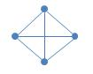
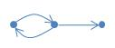
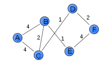

# 그래프 이해와 자료구조 

## 그래프 란 

- 그래프는 실제 세계의 현상이나 사물을 정점(Vertex) 또는 노드(Node)  와 간선(Edge)으로 표현하기 위해 사용
- e.x. 집에서 회사로 가능 경로를 그래프로 표현한 예 

### 그래프 관련 용어
- 노드 (Node) : 위치 , aka 정점(Vertex)
- 간선 (Edge) : 노드를 연결한 선
- 인접 정점 (Adjacent Vertex) : 간선으로 직접 연결된 정점(또는 노드)

#### 참고용어 
- 정점의 차수 (Degree): 무방향 그래프에서 하나의 정점에 인접한 정점의 수 
- 진입 차수 (In-Degree): 방향 그래프에서 외부에서 오는 간선의 수
- 진출 차수 (Out-Degree): 방향 그래프에서 외부로 향하는 간선의 수 
- 경로 길이(Path Length): 경로를 구성하기 위해 사용된 간선의 수
- 단순 경로 (Simple Path): 처음 정점과 끝 정점을 제외하고 중복된 정점이 없는 경로
- 사이클(Cycle): 단순 경로의 시작 정점과 종료 정점이 동일한 경우

단순 경로 (A-B-C)
A-B-C-A-B-D 와 같은 식의 경로는 중복된 정점이 있으므로 단순 경로 아님 

## 그래프의 종류 

#### 무방향 그래프 (undirected Graph)
- 방향이 없음

#### 방향 그래프 (directed Graph)
- 간선에 방향 존재

#### 가중치 그래프 (weighted graph) 또는 네트워크 (Network)
- 간선에 비용 또는 가중치가 할당된 그래프

#### 연결 그래프(Connected Graph) 와 비연결 그래프(Unconnected Graph)
- 연결 그래프 
  - 무방향 그래프에 있는 모든 노드에 대해 항상 경로가 존재하는 경우
- 비연결 그래프
  - 무방향 그래프에서 특정 노드에 대해 경로가 존재하지 않는 경우

#### 사이클(Cycle)과 비순한 그래프 (Acyclic Graph)
- 사이클(Cycle)
  - 단순 경로의 시작 노드와 종료 노드가 동일한 경우
- 비순환 그래프 (Acyclic Graph)
  - 사이클이 없는 그래프 

#### 완전 그래프 
- 그래프의 모든 노드가 서로 연결되어 있는 그래프 

## 그래프와 트리의 차이 

- 트리는 **그래프 중에 속한 특별한 종류**라고 볼 수 있음

|          | 그래프                         | 트리                         |
|----------|-----------------------------|----------------------------|
| 정의       | 노드와 노드를 연결하는 간선으로 표현되는 자료구조 | 그래프의 한 종류, 방향성이 있는 비순환 그래프 |
| 방향성      | 방향 그래프, 무방향 그래프 둘다 존재       | 방향 그래프만 존재                 |
| 사이클      | 사이클 가능. 순환 및 비순환 그래프 모두 존재  | 비순환 그래프로 사이클이 존재하지 않음      |
| 루프 노드    | 루프 노드 존재하지 않음               | 루프 노드 존재함                  |
| 부모/자식 관계 | 부모 자식 개념이 존재하지 않음           | 부모 자식 관계가 존재               |

