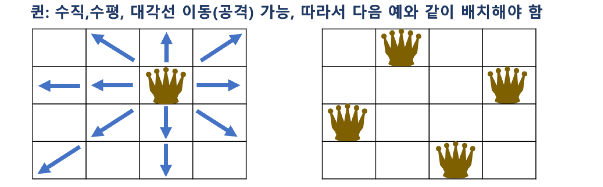

# 백 트래킹 전략(backtracking)

- 백 트래킹 또는 퇴각 검색이라고 부름
- **제약 조건 만족 문제 에서 해를 찾기 위한 전략**
- 여러 가지 해가 될 수 있는 경우에서 해의 집합을 찾을 때 쓰는 전략 
  - e.x. 해가 여러개가 하나의 세트로 되어서 답이 되는 경우가 많다.
    - 하나의 해를 선택해서 또 하나의 해를 더 찾고, 두개를 선택했는데 세번째 해를 찾을 수 없으면, 다시 돌아가서 찾는 그런 방법
- 실제 구현시, **고려할 수 있는 모든 경우의 수 (후보군)를 상태 공간 트리(State Space Tree)를 통해 표현**
  - 각 후보군을 **DFS 방식으로 확인**
  - 상태 공간 트리를 탐색하면서, 제약이 맞지 않으면 해의 후보가 될만한 곳으로 바로 넘어가서 탐색
    - **Promising** : 해당 루트가 조건에 맞는지를 검사하는 기법
    - **Pruning(가지치기)** : 조건에 맞지 않으면 포기하고 다른 루트로 바로 돌아서서, 탐색의 시간을 절약하는 기법

> 즉, 백트래킹은 트리 구조를 기반으로 DFS로 깊이 탐색을 진행하면서 각 루트에 대해 조건에 부합하는지 체크 (Promising),
> 
> 만약 해당 트리(나무)에서 조건에 맞지 않는 노드는 더 이상 DFS로 깊이 탐색을 진행하지 않고, 가지를 쳐버림(Pruning)

## 상태 공간 트리 (State Space Tree)
- 문제 해결 과정의 중간 상태를 각각의 노드로 나타낸 트리
- 보통 트리를 만드는 건 아니지만, 트리의 구조를 띄게

## N Queen 문제 이해
- 대표적인 백트래킹 문제
- NxN 크기의 체스판에 N개의 퀸을 서로 공격 할 수 없도록 배치하는 문제 
- 퀸은 다음과 같이 이동할 수있으므로, 배치된 퀸 간에 공격할 수 없는 위치로 배치해야함

## Pruning (가지치기) for N Queen 문제
- 한 행에는 하나의 퀸 밖에 위치할 수없음 (퀸은 수평이동이 가능하므로)
- 맨 위에 있는 행부터 퀸을 배치하고, 다음 행에 해당 퀸이 이동할 수 없는 위치를 찾아 퀸을 배치
- 만약 앞선 행에 배치한 퀸으로 인해, 다음 행에 해당 퀸들이 이동할 수 없는 위치가 없을 경우에는, 더이상 퀸을 배치하지 않고, 이전 행의 퀸의 배치를 바꿈
  - 즉, 맨 위의 행부터 전체 행까지 퀸의 배치가 가능한 경우의 수를 상태 공간 트리 형태로 만든 후,
    - 각 경우를 맨 위의 행부터 DFS 방식으로 접근, 해당 경우가 진행이 어려울 경우, 더이상 진행하지 않고, 다른 경우를 체크하는 방식

## Promising for N Queen 문제
- 해당 루트가 조건에 맞는지를 검사하는 기법을 활용하여,
- 현재까지 앞선 행에서 배치된 퀸이 이동할 수 없는 위치가 있는지를 다음과 같은 조건으로 학인
  - 한 행에 어차피 하나의 퀸만 배치 가능하므로 수평 체크는 별도로 필요하지 않음 
  - 대각선 체크! abs(행, 열) 로 같은 값이면 제외

