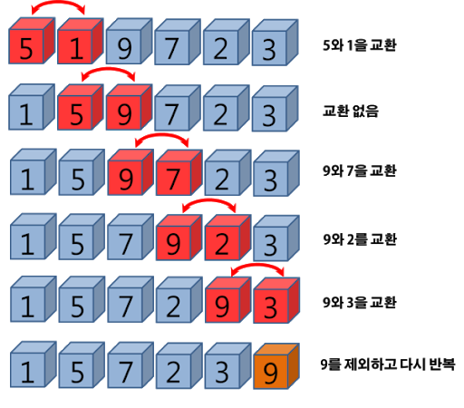

# 버블 정렬 

- 두 인접한 데이터를 비교해서 , 앞에 있는 데이터가 뒤에 있는 데이터가 크면 (앞 데이터 > 뒷 데이터) 자리를 바꾸는 알고리즘 



### 데이터가 두개일 때 버블 데이터 알고리즘 방식으로 구현 하기

```java
import java.util.ArrayList;
import java.util.Collections;

public static void main(String[] args) {
  ArrayList<Integer> dataList = new ArrayList<>();

  dataList.add(4);
  dataList.add(2);
  
  if (dataList.get(0) > dataList.get(1)) {
    Collections.swap(dataList, 0, 1);
  }
}
```

### 데이터가 세개일 때 버블 데이터 알고리즘 방식으로 구현 하기
```java
import java.util.ArrayList;
import java.util.Collections;

public static void main(String[] args) {
  ArrayList<Integer> dataList = new ArrayList<>();

  dataList.add(9);
  dataList.add(2);
  dataList.add(4);

  for (int index = 0; index < dataList.size() -1; index++) {
    if (dataList.get(index) > dataList.get(index + 1)) {
      Collections.swap(dataList, index, index+1);
    }
  }
}

```

### 위의 구현에는 문제가 많다 

- 버블 정렬 안에서 한번의 사이클을 돌 때 마다 가장 큰 수 부터 하나씩은 무조건 정렬 된다 
- 최악의 경우, 모든 수를 정렬할려면 전체 데이터의 갯수 번 전체 데이터를 각각 돌아야하기 때문에 (N^2)

#### 버블 정렬 간단 구현 
```java
 public ArrayList<Integer> sort(ArrayList<Integer> dataList) {
    for (int index = 0; index < dataList.size() - 1; index++) {
      boolean isSwap = false;

      for (int index2 = 0; index2 < dataList.size() - 1 - index ; index2++) {
        if (dataList.get(index2) > dataList.get(index2 + 1)) {
          Collections.swap(dataList, index2, index2 + 1);
          isSwap = true;
        }
      }

      if (!isSwap) break;
    }
    return dataList;
  }
```

## 시간 복잡도
- O(N^2)

- 최선일 때는 O(N) 이지만 크게 중요하지는 않음 