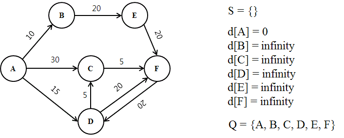

# 최단 경로 알고리즘 

- 최단 경로 문제란 두 노드를 잇는 가장 짧은 경로를 찾는 문제
- 가중치 그래프(Weighted Graph)에서 간선(Edge)의 가중치 합이 최소가 되도록 경로를 찾는 것이 목적

## 최단 경로 문제 종류 

1. 단일 출발 최단 경로 문제 
   - 그래프 내의 특정 노드 u 에서 출발하여, 그래프 내의 모든 다른 노드에 도착하는 가장 짧은 경로를 찾는 문제
2. 단일 도착 최단 경로 문제
   - 모든 노드들로부터 출발해서, 그래프 내의 특정 노드 u로 도착하는 가장 짧은 경로를 찾는 문제 
3. 단일 쌍 최단 경로 문제 
   - 주어진 노드 u 와 v 간의 최단 경로를 찾는 문제
4. 전체 쌍 최단 경로 
   - 그래프 내의 모든 노드 쌍(u,v)사이에 대한 최단 경로를 찾는 문제

# 최단 경로 알고리즘 - 다익스트라 알고리즘 
- 위의 최단 경로 문제 종류 중, 1번에 해당
  - 하나의 정점에서 다른 모든 정점에 도착하는 가장 짧은 거리를 구하는 문제 

## 다익스트라 알고리즘 로직 
- 첫 정점을 기준으로 연결되어 있는 정점들을 추가해 가며, 최단 거리를 갱신하는 방법
- 다익스트라 알고리즘은 너비우선탐색(BFS)와 유사
  - 첫 정점부터 각 노드간의 거리를 저장하는 배열을 만든 후, 첫 정점의 인접 노드 간의 거리부터 먼저 계산하면서, 첫 정점부터 해당 노드간의 가장 짧은 거리를 해당 배열에 업데이트 

> 다익스트라 알고리즘의 다양한 변형 로직이 있지만, 가상 개선된 우선순위 큐를 사용하는 방식에 집중해서 설명

### 우선순위 큐를 활용한 다익스트라 알고리즘 
- 우선순위 큐는 MinHeap(최소 힙) 방식을 활용해서, 현재 가장 짧은 거리를 가진 노드 정보를 먼저 꺼내게 됨 

##### 1. 첫 정점을 기준으로 배열을 선언하여 첫 정점에서 각 정점까지의 거리를 저장
- 초기에는 첫 정점의 거리는 0 , 나머지는 무한대로 저장(inf)
- 우선순위 큐에 (첫 정점, 거리 0)만 먼저 넣음

##### 2. 우선순위 큐에서 노드를 꺼냄
- 처음에는 첫 정점만 저장되어 있으므로, 첫 정점이 꺼내짐
- 첫 정점에 인접한 노드들 각각에 대해, 
  - 첫 정점에서 각 노드로 가는 거리와 현재 배열에 저장되어 있는 첫 정점에서 각 정점까지의 거리를 비교
- 배열에 저장되어 있는 거리보다, 첫 정점에서 해당 노드로 가는 거리가 더 짧은 경우, 
  - **배열에 해당 노드의 거리를 업데이트**
- 배열에 해당 노드의 거리가 업데이트 된 경우, 우선순위 큐에 넣는다.
  - 결과적으로 너비 우선 탐색 방식과 유사하게, 첫 정점에 인접한 노드들을 순차적으로 방문하게 됨
  - 만약 배열에 기록된 현재까지 발견된 가장 짧은 거리보다, 더 긴 거리(루트)를 가진 (노드, 거리)의 경우에는 해당 노드와 인접한 노드간의 거리 계산 X

##### 3. 2번의 과정을 우선순위 큐에 꺼낼 노드가 없을 때까지 반복한다.

## 시간 복잡도 
- 다익스트라 알고리즘은 크게 다음 두가지 과정을 거침 
  - 과정1: 각 노드마다 인접한 간선들을 모두 검사하는 과정
  - 과정2: 우선순위 큐에 노드/거리 정보를 넣고 삭제(pop)하는 과정

#### 각 과정별 시간 복잡도
- 과정1: 각 노드는 최대 한번 방문하므로 (첫노드와 해당 노드간의 갈 수 있는 루트가 있는 경우만 해당), 그래프의 모든 간선은 최대 한번씩 검사
  - 즉, 각 노드마다 인접한 간선들을 모두 검사하는 과정은 **O(E)** 시간이 걸림, E는 간선(edge)의 약지
- 과정2: 우선순위 큐에 가장 많은 노드 ,거리 정보가 들어가는 경우, 우선순위 큐에 노드/거리 정보를 넣고, 삭제하는 과정이 최악의 시간이 걸림
  - 우선순위 큐에 가장 많은 노드, 거리 정보가 들어가는 시나리오는 그래프의 모든 간선이 검사될 때마다, 배열의 최단 거리가 갱신되고, 우선 순위 큐에 노드/거리가 추가되는 것
  - 이 때 추가는 각 간선마다 최대 한 번 일어날 수 있으므로, 최대 **O(E)**의 시간이 걸리고, O(E)개의 노드/거리 정보에 대해 우선순위 큐를 유지하는 작업은 O(logE)가 걸림
    - 따라서 해당 과정의 시간 복잡도는 **O(ElogE)**

