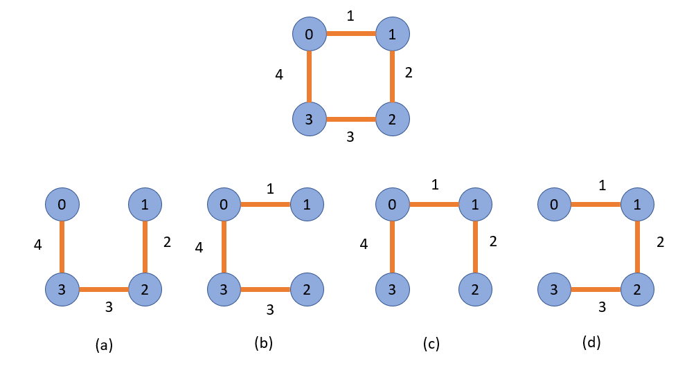
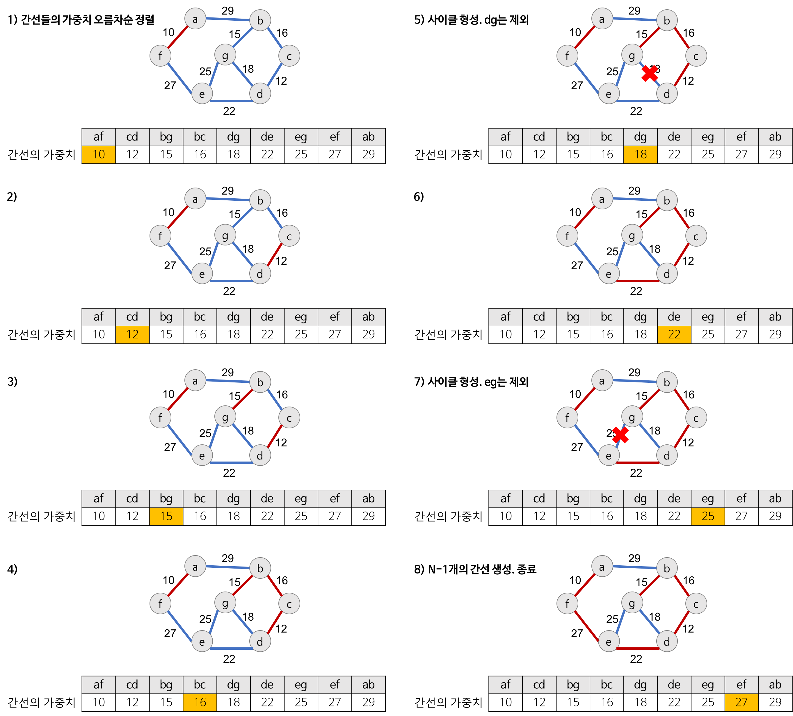

# 최소 신장 트리 

## 신장 트리란?
- Spanning Tree, 또는 신장 트리 라고 불림
- 원래의 그래프의 모든 노드가 연결되어 있으면서 트리의 속성을 만족하는 그래프 
- 신장 트리의 조건
  - 본래의 그래프의 모든 노드를 포함해야함
  - 모든 노드가 서로 연결
  - 트리의 속성을 만족시킴(사이클 X)

## 최소 신장 트리 
- Minimum Spanning Tree, MST 
- 가능한 Spanning Tree 중에서, **간선의 가중치 합이 최소인 Spanning Tree을 지칭**

### 최소 신장트리 알고리즘
- 크루스칼 알고리즘 
- 프림 알고리즘

## 크루스칼 알고리즘
- 탐욕 알고리즘을 기초로 하고 있음 (당장 눈 앞의 최소 비용을 선택해서, 결과적으로 최적의 솔루션을 찾음)

1. 모든 정점을 독립적인 집합으로 만든다.
2. **모든 간선을 비용을 기준으로 정렬**하고, **비용이 작은 간선부터 양 끝의 두 정점을 비교**
3. 두 정점의 최상위 정점을 확인하고, 서로 다를 경우 두 정점을 연결한다. (**사이클 없이**)

## Union-Find 알고리즘 
- Disjoint Set을 표현할 때 사용하는 알고리즘으로 트리 구조를 활용하는 알고리즘
- 간단하게, 노드들 중에 연결된 노드를 찾거나, 노드들을 서로 연결할 때 (합칠 때) 사용

#### Disjoint Set 이란?
  - 서로 중복되지 않는 부분 집합들로 나눠진 원소들에 대한 정보를 저장하고 조직하는 자료구조 
  - 공통 원소가 없는 (서로소) 상호 배타적인 부분집합들로 나눠진 원소들에 대한 자료구조 
  - Disjoint Set = 서로소 집합 자료구조 

---
1. 초기화 
   - n 개의 원소가 개별 집합으로 이뤄지도록 초기화
2. Union
    - 두 개별 집합을 하나의 집합으로 합침, 두 트리를 하나의 트리로 만듬

3. Find
    - 여러 노드가 존재할 때, 두개의 노드를 선택해서, 현재 두 노드가 서로 같은 그래프에 속하는지 판별하기 위해
    - 각 그룹의 최상단 원소 (즉, 루트 노드) 를 확인 
    - 같은 집합에 있다는 것은 이미 연결 되어 있다는 것 
    - 만약 같은 집합에 있는 두 노드를 선택하면 연결 된다는 뜻!

### Union-Find 알고리즘의 고려할 점
- Union 순서에 따라서, 최악의 경우 링크드 리스트와 같은 형태가 될 수 있음
- 이 때는 Find/Union 시 계산량이 O(N)이 될 수 있으므로,
  - 해당 문제를 해결하기 위해 union-by-rank, path-compression 기법이 있음

#### union-by-rank 기법 
트리를 합칠 때 어떻게 합치면 좋을 지 정의한 기법 
##### union-by-rank 규칙
- 각 트리에 대해 높이(rank)를 기억해두고, 
- Union 시 두 트리의 높이(rank)가 다르면,
  - **높이가 작은 트리를 높이가 큰 트리에 붙임**
  - (즉, 높이가 큰 트리의 루트 노드가 합친 집합의 루트 노드가 되게)
- 높이가 h-1인 두 개의 트리를 합칠 때는 
  - **한쪽의 트리 높이를 1 증가시켜주고, 다른 쪽의 트리를 해당 트리에 붙여줌**

##### 시간 복잡도
- 초기화 시, 모든 원소는 높이(rank)가 0인 개별 집합인 상태에서, 하나씩 원소를 합칠 떄, union-by-rank 기법을 사용한다면, 
  - 높이가 h인 트리가 만들어지려면, 높이가 h-1인 두개의 트리가 합쳐져야함
  - 높이가 h-1인 트리를 만들기 위해 최소 n개의 원소가 필요하다면, 높이가 h인 트리가 만들어지기 위해서는 최소 2n개의 원소가 필요 
    - **union/find 연산의 시간복잡도는 O(N)이 아닌 , O(logN)으로 낮출 수 있음!**

#### path-compression 기법 
Find 실행시에 작동되는 기법

##### path-compression 규칙 
- Find를 실행한 노드에서 거쳐간 노드를 루트에 다이렉트로 연결하는 기법
- Find를 실행한 노드는 이후부터는 루트 노드를 한번에 알 수 있음

---
- union-by-rank 와 path compression 기법 사용시 시간 복잡도는 다음 계산식을 만족함이 증명됨
  - O(Mlog*N)
  - log*N은 다음값을 가짐이 증명됨
    - N이 2^65536값을 가지더라도, log*N 의 값이 5의 값을 가지므로, 거의 O(1), 즉 상수 값에 가깝다고 볼 수 있음 

  

## 크루스칼 알고리즘 시간 복잡도 
- 크루스칼 알고리즘의 시간 복잡도는 O(ELogE)
  - 다음 단계에서 2번, 간선을 비용 기준으로 정렬하는 시간에 좌우됨 (즉, 간선을 비용 기준으로 정렬하는 시간이 가장 큼)

1. 모든 정점을 독립적인 집합으로 만든다.
2. 모든 간선을 비용을 기준으로 정렬하고, 비용이 작은 간선부터 양 끝의 두 정점을 비교
   - 퀵 소트를 사용하만면, 시간 복잡도는 O(NlogN)이고, 간선이 n 이므로 O(ElogE)
3. 두 정점의 최상위 정점을 확인하고, 서로 다를 경우 두 정점을 연결한다.
    - 최소 신장 트리는 사이클이 없으므로, 사이클이 생기지 않도록 하는 것
    - union-by-rank 와 path compression 기법 사용시 시간 복잡도가 결국 상수 값에 가까움 , O(1)

