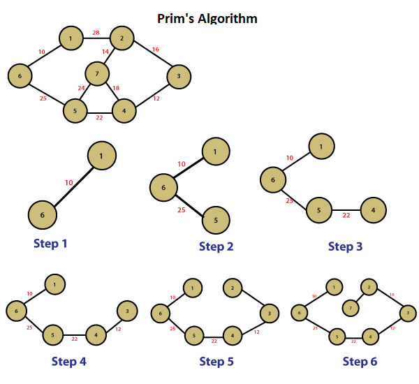

# 프림 알고리즘
- 대표적인 최소 신장 트리 알고리즘
- 시작 정점을 선택한 후, 정점에 인접한 간선 중 최소 간선으로 연결된 정점을 선택하고,
  - 해당 정점에서 다시 최소 간선으로 연결된 정점을 선택하는 방식으로 최소 신장트리를 확장해가는 방식

#### 크루스칼 알고리즘, 프림 알고리즘 비교
- 둘 다 , 탐욕 알고리즘을 기초로 하고 있음
  - 크루스칼 알고리즘은 가장 가중치가 작은 간선부터 선택하면서 MST를 구함
  - 프림 알고리즘은 특정 정점에서 시작, 해당 정점에 연결된 가장 가중치가 작은 간선을 선택, 간선으로 연결된 정점들에 연결된 간선 중에서 가장 가중치가 작은 간선을 택하는 방식으로 MST를 구함

## 프림 알고리즘 순서

1. 임의의 정점을 선택, '연결된 노드 집합'에 삽입
2. 선택된 정점에 연결된 간선들을 간선 리스트에 삽입
3. 간선 리스트에서 최소 가중치를 가지는 간선부터 추출해서,
   - 해당 간선에 연결된 인접 정점이 '연결된 노드 집합'에 이미 들어 있다면,스킵함(cycle 발생을 막기 위함)
   - 해당 간선에 연결된 인접 정점이 '연결된 노드 집합'에 들어 있지 않으면, 해당 간선을 선택하고, 간선 정보를 삽입
4. 추출한 간선은 간선 리스트에서 제거
5. 간선 리스트에 더 이상의 간선이 없을 때까지 3~4번 반복

## 프림 알고리즘 코드
0. 모든 간선 정보를 저장 (adjacentEdges)
1. 임의의 정점을 선택, '연결된 노드 집합(connectedNodes)'에 삽입
2. 선택된 정점에 연결된 간선들을 간선 리스트 (candidateEdgeList)에 삽입
3. 간선 리스트(candidateEdgeList)에서 최소 가중치를 가지는 간선부터 추출해서,
    - 해당 간선에 연결된 인접 정점이 '연결된 노드 집합'에 이미 들어 있다면, 스킵함 (cycle 발생을 막기 위함)
    - 해당 간선에 연결된 인접 정점이 '연결된 노드 집합'에 들어 있지 않으면, 해당 간선을 선택하고, 해당 간선 정보를 '최소 신장 트리(mst)'에 삽입
      - 해당 간선에 연결된 인접 정점의 간선들 중, '연결된 노드 집합(connectedNodes)'에 없는 노드와 연결된 간선들만 간선 리스트(candidateEdgeList)에 삽입
        - '연결된 노드 집합(connecteNodes)'에 있느 노드와 연결된 간선들을 간선 리스트에 삽입해도, 해당 간선은 스킵될 것이기 때문
        - 어차피 스킵될 간선을 간선 리스트(candidateEdgeList)에 넣지 않으므로 해서, 간선 리스트(candiateEdgeLsit)에서 최소 가중치를 가지는 간선부터 추출하기 위한 자료구조 유지를 위한 effort를 줄일 수 있음(예, 최소힙 구조 사용)
4. 선택된 간선은 간선 리스트에서 제거
5. 간선 리스트에 더 이상의 간선이 없을 때까지 3~4번을 반복

### 프림 알고리즘 시간 복잡도 
- 최악의 경우, while 구문에서 모든 간선에 대해 반복하고, 최소 힙 구조를 사용하므로 O(ElogE) 시간 복잡도 

