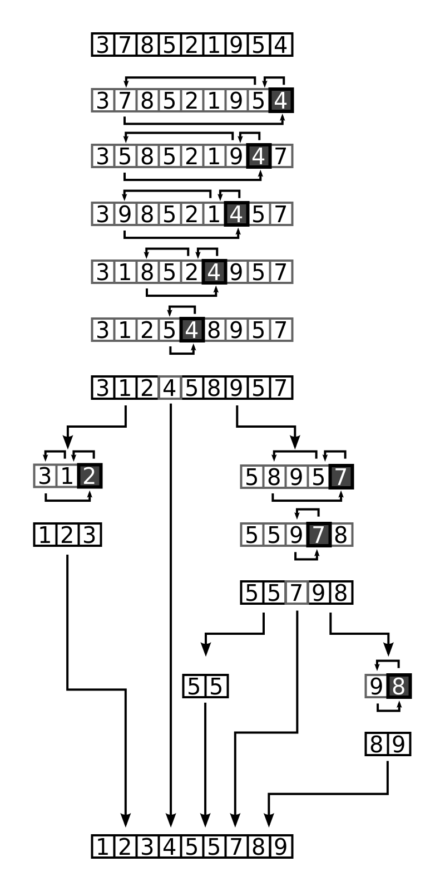

# 퀵 정렬

- 정렬 알고리즘의 꽃
- 기준점(pivot)을 정해서, 기준범보다 작은 데이터는 왼쪽(left), 큰 데이터는 오른쪽(right)으로 모으는 함수를 작성
- 각 왼쪽(left), 오른쪽(right)는 재귀용법을 사용해서 다시 동일 함수를 호출하여 위 작업을 반복 
- 함수는 왼쪽(left) + 기준점(pivot) + 오른쪽(right)을 리턴함 



## 시간복잡도 
- 병합정렬과 유사 , O(NlogN)

- 만약 이미 정렬된 배열이라면,
- 계속 오른쪽이 계속 정렬되고 모두 pivot 이 되면서 depth 가 n이 되어서 
- O(N^2) 의 시간 복잡도를 가지게 된다

### 다음 리스트를 맨 앞에 데이터를 기준으로 작은 데이터는 left 변수에, 그렇지 않은 데이터는 right 변수에 넣기 
- 이 과정은 재귀 용법을 활용해서 전체 알고리즘을 만들기 전에 기본적인 메소드를 만들어서 어떻게 해결할지 고민해보는 과정
- dataList = {4, 1, 2, 5, 7}

```java
import java.util.ArrayList;

public class Split {
  public void splitFunc(ArrayList<Integer> dataList) {
    if (dataList.size() <= 1) {
      return; 
    }
    int pivot = dataList.get(0);

    ArrayList<Integer> leftArr = new ArrayList<>();
    ArrayList<Integer> rightArr = new ArrayList<>();

    for (int index = 1; index < dataList.size(); index++) {
      if (dataList.get(index) > pivot) {
        rightArr.add(dataList.get(index));
      } else {
        leftArr.add(dataList.get(index));
      } 
    }

    System.out.println("leftArr = " + leftArr);
    System.out.println("rightArr = " + rightArr);
  }
}

```