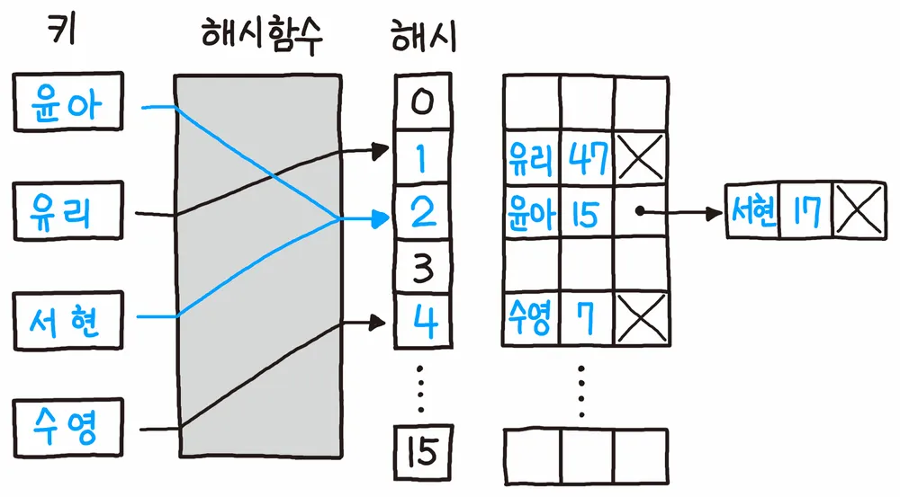

# 해시 테이블 (Hash Table)

- 키(key)에 데이터(value)를 매핑할 수 있는 데이터 구조
- 해쉬 함수를 통해, 배열에 키에 대한 데이터를 저장할 수 있는 구조(인덱스 번호)를 계산
- key를 통해 바로 데이터가 저장되어 있는 주소를 알 수 있으므로, 저장 및 탐색 속도가 획기적을 빨라짐
- 미리 해쉬 함수가 생성할 수 있는 주소(인덱스 번호)에 대한 공간을 배열로 할당한 후, 키에 따른 데이터 저장 및 탐색을 지원한다.



## 알아둘 용어
- 해시 함수 (Hash Function) : 임의의 데이터를 **고정된 길이의 값**으로 리턴해주는 함수
  - 해시, 해시 값, 해시 주소 : 해싱 함수를 통해 리턴된 고정된 길이의 값
- 해시 테이블 (Hash Table)   : 키 값의 연산에 의해 직접 접근이 가능한 데이터 구조
  - 슬롯(Slot) : 해시 테이블에서 한 개의 데이터를 저장할 수 있는 공간

## 간단한 해시 예

```java

public class CustomHash {
  public Slot[] hashTable;

  public CustomHash(Integer size) {
    this.hashTable = new Slot[size];
  }
  
  public class Slot{
    String value;

    Slot(String value) {
      this.value = value;
    }
  }

  private Integer hashFunc(String key) { //간단한 해시 함수
    return (int) (key.charAt(0)) % this.hashTable.length; 
  }

  public boolean saveData(String key, String value) {
    Integer address = this.hashFunc(key);
    
    if (this.hashTable[address] != null) {
      this.hashTable[address].value = value;
    } else {
      this.hashTable[address] = new Slot(value);
    }

    return true;
  }

  public String getData(String key) {
    Integer address = this.hashFunc(key);
    if (this.hashTable[address] != null) {
      return this.hashTable[address].value;
    } else {
      return null;
    } 
  }
  
}
```

## 해시 테이블의 장단점과 주요용도 

### 장점
- 데이터 저장/읽기 속도가 빠르다. (검색 속도가 빠르다.)
- 해시는 키에 대한 데이터가 있는지(중복) 확인이 쉽다.

### 단점
- 일반적으로 저장공간이 좀 더 많이 필요하다.
- **여러 키에 해당하는 주소가 동일할 경우, 충돌을 해결하기 위한 별도 자료구조가 필요**

### 주요 용도 
- 검색이 많이 필요한 경우
- 저장, 삭제, 읽기가 빈번한 경우
- 캐시 구현시(중복 확인이 쉬워서)


## 충돌(Collision) 해결 알고리즘 (좋은 해시 함수 사용하기)
- **해시 테이블의 가장 큰 문제는 충돌이 일어날때** 
- 이 문제를 충돌(Collision) 또는 해시 충돌(Hash Collision)이라고 부름


### Chaining 기법 

- **개방 해시 또는 Open Hashing 기법** 중 하나
  - 해시 테이블 저장공간외의 공간을 활용하는 기법 
  - 기존 해시테이블 공간외에 Linked List 를 활용하여 계속 연결 하는 느낌
- 충돌이 일어나면, 링크드 리스트로 데이터를 추가로 뒤에 연결시켜서 저장하는 기법

```java
import java.util.Objects;

public class CustomHashWithChaining {
  public Slot[] hashTable;

  public CustomHashWithChaining(Integer size) {
    this.hashTable = new Slot[size];
  }
  
  public class Slot{
    String key;  // 추가된 부분
    String value;
    Slot next; // Single LinkedList 구조 형식으로 구현

    Slot(String key, String value) {
      this.key = key;
      this.value = value;
      this.next = null;
    }
  }

  private Integer hashFunc(String key) {
    return (int) (key.charAt(0)) % this.hashTable.length; 
  }

  public boolean saveData(String key, String value) {
    Integer address = this.hashFunc(key);
    
    if (this.hashTable[address] != null) { //해당 key 에 해당하는 해시 테이블이 비어있지 않으면,

      //Single Linked List 탐색을 위한 두개의 Slot 선언
      Slot findSlot = this.hashTable[address]; 
      Slot prevSlot = this.hashTable[address];

      while (findSlot != null) { //Single Linked List 를 탐색하면서 같은 key 가 있는지 확인 
        
        if (findSlot.key.equals(key)) { //같은 key가 있으면 값을 업데이트 시켜줌, 아닐 때, prev, findSlot 다음 값으로 업데이트
          findSlot.value = value;
          return true;
        } else { 
          prevSlot = findSlot;
          findSlot = findSlot.next;
        }
      }
      // 전부 돌았는데 없으면, 마지막 LinkedList 에 새로운 Slot 추가
      prevSlot.next = new Slot(key, value);
      
    } else {
      this.hashTable[address] = new Slot(key, value);
    }

    return true;
  }

  public String getData(String key) {
    Integer address = this.hashFunc(key);
    if (this.hashTable[address] != null) {

      Slot findSlot = this.hashTable[address];
      
      while (findSlot != null) {
        if (Objects.equals(findSlot.key, key)) {
          return findSlot.value;
        } else {
          findSlot = findSlot.next;
        }
      }
      
      return null;
    } else {
      return null;
    } 
  }
  
}
```

### Linear Probing 기법
- **폐쇄 해싱 또는 Closed Hashing 기법**
  - 기존 해시 테이블이 충돌하면 그 다음 슬롯이 비어있으면 그 다음 슬롯에 저장하고, 그렇게 충돌 안되는 곳에 저장하는 곳
- 충돌이 일어나면, 해당 hash address의 다음 address 부터 맨 처음 나오는 빈공간에 저장하는 기법 
  - 저장공간 활용도가 높아진다.

```java
import java.util.Objects;

public class CustomHashWithChaining {
  public Slot[] hashTable;

  public CustomHashWithChaining(Integer size) {
    this.hashTable = new Slot[size];
  }

  public class Slot{
    String key;  // 추가된 부분
    String value;

    Slot(String key, String value) {
      this.key = key;
      this.value = value;
    }
  }

  private Integer hashFunc(String key) {
    return (int) (key.charAt(0)) % this.hashTable.length;
  }

  public boolean saveData(String key, String value) {
    Integer address = this.hashFunc(key);
    
    if (this.hashTable[address] != null) { //해당 key 에 해당하는 해시 테이블이 비어있지 않으면,
      
      if (this.hashTable[address].key.equals(key)) {
        this.hashTable[address].value = value;
        return true;
      } else {
        int currAddress = address + 1;
        
        while (this.hashTable[currAddress] != null) {
        
          if (this.hashTable[currAddress].key.equals(key)) {
            this.hashTable[currAddress].value = value;
            return true;
          }
          
          currAddress++;
          if (currAddress >= this.hashTable.length) { //이 부분은 처음으로 넘어가기 애매해서 간단하게 구현
            return false;            
          }
        }

        this.hashTable[currAddress] = new Slot(key, value);
        return true;
      } 
      
    } else {
      this.hashTable[address] = new Slot(key, value);
    }

    return true;
  }

  public String getData(String key) {
    Integer address = this.hashFunc(key);
    if (this.hashTable[address] != null) {

      if (this.hashTable[address].key == key) {
        return this.hashTable[address].value;
      } else {
        int currAddress = address + 1;
        while (this.hashTable[currAddress] != null) {
          if (this.hashTable[currAddress].key.equals(key)) {
            return this.hashTable[currAddress].value;
          } else {
            currAddress++;
            if (currAddress >= this.hashTable.length) {
              return null;
            }
          } 
        }
        return null;
      }
      
    } else {
      return null;
    }
  }

}
```

## JAVA HASHMAP

- 해시 테이블 구조를 활용하여 구현된 JAVA Collection Framework 에 속한 클래스 

```java
import java.util.HashMap;


public static void main(String[] args) {
  HashMap<Integer, String> hashMap1 = new HashMap<>();
  hashMap1.put(1, "사과");
  hashMap1.put(2, "바나나");

  hashMap1.get(1);
}

```

### 시간복잡도 
배열에 데이터를 저장하고, 검색할 때 : O(N)