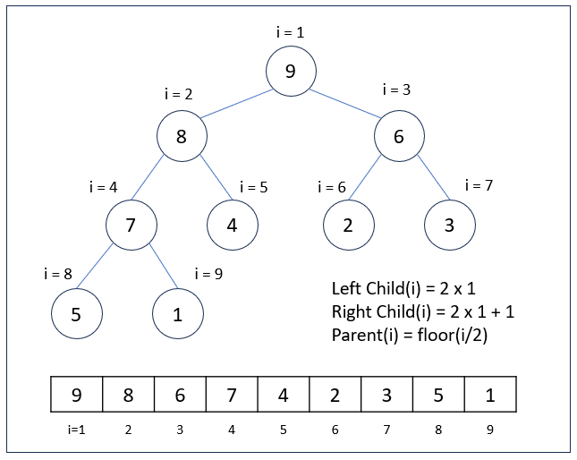
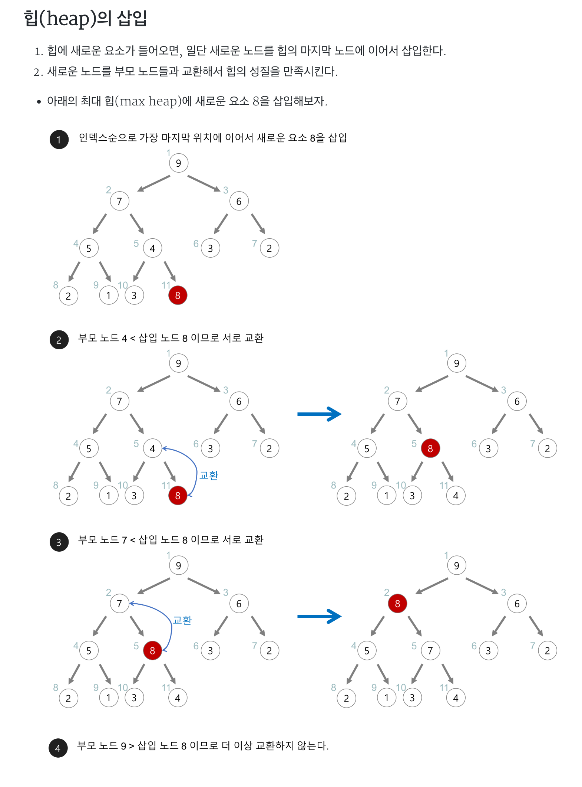
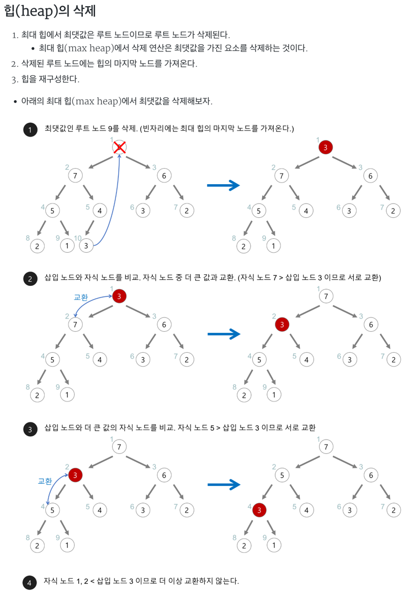

# 힙

- 데이터에서 최대값과 최소값을 빠르게 찾기 위해 고안된 **완전 이진 트리**
  - **완전 이진 트리**: 노드를 삽입할 때 최하단 왼쪽 노드부터 차례대로 삽입하는 트리 

## 힙을 사용하는 이유
- 배열에 데이터를 넣고, 최대값과 최소값을 찾으려면 O(N)이 걸림
- 이에 반해, 힙에 데이터를 넣고, 최대값과 최소값을 찾으면, O(logN)이 걸림
- 우선수위 큐와 같이 최대값 또는 최소값을 빠르게 찾아야 하는 자료구조 및 알고리즘 구현등에 활용됨




## 힙과 이진 탐색 트리의 공통점과 차이점 

### 공통점 
- 힙과 이진 탐색 트리는 모두 이진 트리

### 차이점 
- 힙은 각 노드의 값이 자식 노드보다 크거나 값음 (Max Heap의 경우)
- 이진 탐색 트리는 왼쪽 자식 노드의 값이 가장 작고, 그다음 부모 노드, 그다음 오른쪽 자식 노드 값이 가장 큼
- 힙은 이진 탐색 트리의 조건인 자식 노드에서 작은 값은 왼쪽, 큰 값은 오른쪽 이라는 조건은 없음
  - 힙의 왼쪽 및 오른쪽 자식 노드의 값은 오른쪽이 클 수도 있고, 왼쪽이 클 수도 있음 
- 이진 탐색 트리는 탐색을 위한 구조, 힙은 최대/최소값 검색을 위한 구조 중 하나로 이해하면 됨


## 힙의 구조 
- 힙은 최대값을 구하기 위한 구조 (최대 힙, Max Heap)와, 최소값을 구하기 위한 구조 (최소 힙, Min Heap)으로 분류할 수 이씅ㅁ
- 힙은 다음과 같이 두가지 조건을 가지고 있는 자료구조 
  1. 각 노드의 값은 해당 노드의 자식 노드가 가진 값보다 크거나 같다. (최대 힙의 경우) - 왼쪽자식노드 + 오른쪽자식노드 <= 부모노드
    - 최소 힙의 경우는 각 노드의 값은 해당 노드의 자식 노드가 가진 값보다 크거나 작음 - 왼쪽자식노드 + 오른쪽자식노드 >= 부모노드
  2. 완전 이진 트리의 형태를 가짐


## Max Heap의 경우 힙의 추가/삭제
### 힙의 추가
- 최하단부 왼쪽 노드부터 채워지고 
- 채워진 노드위치에서, 부모 노드보다 값이 클 경우, 부모 노드와 위치를 바꿔주는 작업을 반복해서 수행한다 (aka. swap)




### 힙의 삭제
- 보통 삭제는 root 노드를 삭제하는 것이 일반적이다.
  - 힙의 용도는 최대값 또는 최소 값을 root 노드에 놓아서, **최대값과 최소값을 바로 꺼내쓸수 있도록 하는 것**이기 때문!
- 상단의 데이터 삭제시, 가장 최하단부 왼쪽에 위치한 노드 (일반적으로 가장 마지막에 추가한 노드) 를 root 노드로 이동
- root 노드의 값이 child 노드 보다 작을 경우, root 노드의 child 노드 중 가장 큰 값을 가진 노드와 root 노드 위치를 바꿔주는 작업을 반복해서 수행한다 (swap)



## 힙의 시간 복잡도
- depth를 h라고 표기한다면, 
- N개의 노드를 가지는 heap에 데이터 삽입 또는 삭제시, 최악의 경우 root 노드에서 leaf 노드까지 비교해야 하므로 h = log2N에 가까우므로,
  - 시간 복잡도는 O(logN)

## 힙의 구현 

### 힙과 배열 
- 일반적으로 힙 구현시 **배열 자료구조를 활용**함
- 배열은 인덱스가 0번부터 시작하지만, 힙 구현의 편의를 위해, root 노드 인덱스 번호를 1로 지정하면 구현이 좀더 수월


- **부모 노드 인덱스 번호** = 자식 노드 인덱스 번호 / 2 (2로 나눈 몫)
- **왼쪽 자식 노드 인덱스 번호** = 부모 노드 인덱스 번호 * 2
- **오른쪽 자식 노드 인덱스 번호** = 부모 노드 인덱스 번호 * 2 +1

#### 힙 구현에 사용된 Collections.swap() 메서드 사용법 이해하기 
- swap 이란, 두 데이터의 위치를 맞바꾸는 것을 의미
- swap 함수를 별도로 구현할 수 있지만, JAVA에서는 Collections 패키지에서 swap 메서드를 제공해줌 
  - 하나의 배열 안에 있는 두 데이터의 위치를 서로 맞바꾸고 싶을 때 사용 가능 

```java
import java.util.Collections;

/**
 * list: 스왑할 데이터들이 들어 있는 배열
 * index1: 스왑할 데이터의 인덱스 번호
 * index2: 스왑할 데이터의 인덱스 번호
 */
public static void main(String[] args) {
  Collections.swap(List list, int index1, int index2);
}
```

### 힙 구현
```java
public class Heap {
    public ArrayList<Integer> heapArray = null;

    public Heap(Integer data) {
        this.heapArray = new ArrayList<Integer>();
        // 배열은 인덱스가 0번부터 시작하지만, 힙 구현의 편의를 위해, root 노드 인덱스 번호를 1로 지정하기 위해,
        // 0번 인덱스에는 강제로 null 을 넣어주기로 함
        this.heapArray.add(null);
        this.heapArray.add(data);
    }

    public boolean move_up(Integer inserted_idx) {
        if (inserted_idx <= 1) {
            return false;
        }
        Integer parent_idx = inserted_idx / 2;
        if (this.heapArray.get(inserted_idx) > this.heapArray.get(parent_idx)) {
            return true;
        } else {
            return false;
        }
    }

    public boolean insert(Integer data) {
        Integer inserted_idx, parent_idx;
        if (this.heapArray == null) {
            this.heapArray = new ArrayList<Integer>();
            this.heapArray.add(null);
            this.heapArray.add(data);
            return true;
        }

        this.heapArray.add(data);
        inserted_idx = this.heapArray.size() - 1;

        while (this.move_up(inserted_idx)) {
            parent_idx = inserted_idx / 2;
            Collections.swap(heapArray, inserted_idx, parent_idx);
            inserted_idx = parent_idx;
        }
        return true;
    }

    public boolean move_down(Integer popped_idx) {
        Integer left_child_popped_idx, right_child_popped_idx;

        left_child_popped_idx = popped_idx * 2;
        right_child_popped_idx = popped_idx * 2 + 1;

        // CASE1: 왼쪽 자식 노드도 없을 때
        if (left_child_popped_idx >= this.heapArray.size()) {
            return false;
            // CASE2: 오른쪽 자식 노드만 없을 때
        } else if (right_child_popped_idx >= this.heapArray.size()) {
            if (this.heapArray.get(popped_idx) < this.heapArray.get(left_child_popped_idx)) {
                return true;
            } else {
                return false;
            }
            // CASE3: 왼쪽, 오른쪽 자식 노드 모두 있을 때
        } else {
            if (this.heapArray.get(left_child_popped_idx) > this.heapArray.get(right_child_popped_idx)) {
                if (this.heapArray.get(popped_idx) < this.heapArray.get(left_child_popped_idx)) {
                    return true;
                } else {
                    return false;
                }
            } else {
                if (this.heapArray.get(popped_idx) < this.heapArray.get(right_child_popped_idx)) {
                    return true;
                } else {
                    return false;
                }
            }
        }
    }

    public Integer pop() {
        Integer returned_data, popped_idx, left_child_popped_idx, right_child_popped_idx;

        if (this.heapArray.size() <= 1) {
            return null;
        }

        returned_data = this.heapArray.get(1);
        this.heapArray.set(1, this.heapArray.get(this.heapArray.size() - 1));
        this.heapArray.remove(this.heapArray.size() - 1);
        popped_idx = 1;

        while (this.move_down(popped_idx)) {
            left_child_popped_idx = popped_idx * 2;
            right_child_popped_idx = popped_idx * 2 + 1;

            if (right_child_popped_idx >= this.heapArray.size()) {
                if (this.heapArray.get(popped_idx) < this.heapArray.get(left_child_popped_idx)) {
                    Collections.swap(this.heapArray, popped_idx, left_child_popped_idx);
                    popped_idx = left_child_popped_idx;
                }
            } else {
                if (this.heapArray.get(left_child_popped_idx) > this.heapArray.get(right_child_popped_idx)) {
                    if (this.heapArray.get(popped_idx) < this.heapArray.get(left_child_popped_idx)) {
                        Collections.swap(this.heapArray, popped_idx, left_child_popped_idx);
                        popped_idx = left_child_popped_idx;
                    }
                } else {
                    if (this.heapArray.get(popped_idx) < this.heapArray.get(right_child_popped_idx)) {
                        Collections.swap(this.heapArray, popped_idx, right_child_popped_idx);
                        popped_idx = right_child_popped_idx;
                    }
                }
            }
        }
        return returned_data;
    }
}
```